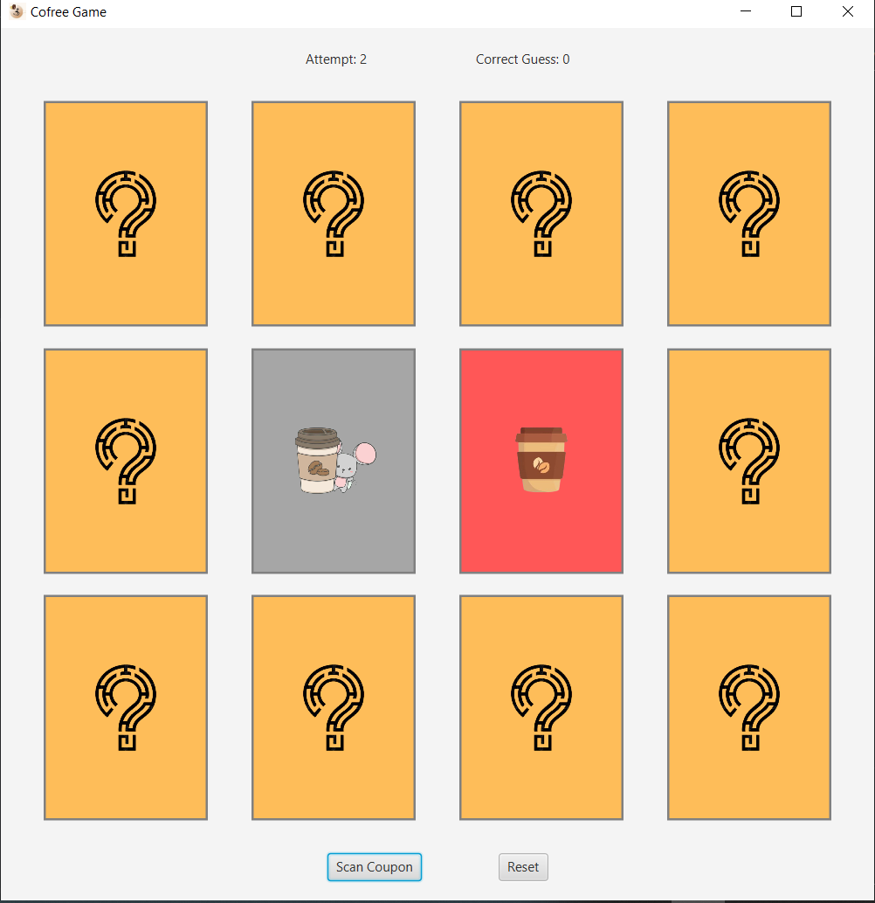
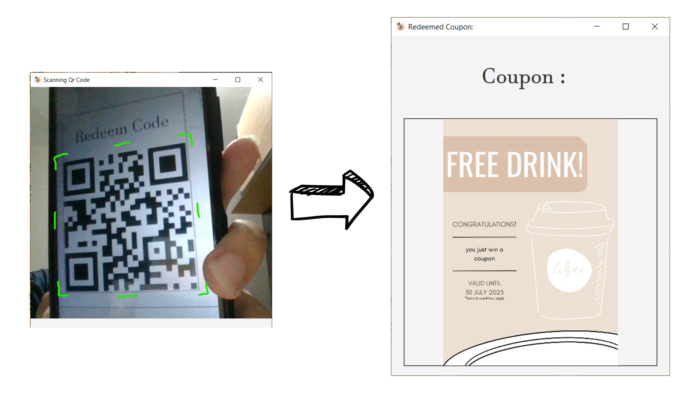

# Cofree Project

## Instalation

#### Requirement

* JDK 19.0.2
* Apache Maven 3.9.2
* OpenCV 4.7.0
* Visual Studio Code and its java extension

#### Step 0

Make sure everything in requirement is installed and connected to the system path. In addtion, make sure openCV is in the java library.

#### Step 1

Open the project directory and run `mvn install` or `mvn clean install`

#### Step 2

Open visual studio code on the build path, choose Run and Debug tab then pick App as the main project. Finally, choose Start Debugging (F5).

## Application Features

### Games

#### Phase 1

Phase 1 of the application is user playing the game normally. To play the game simply choose 2 card, each card then will be revealed. User is tasked to match all the card before they completely out of attempt.

#### Phase 2

After all attempt is lose, then user will given a popup where the user could click "Reveal Prize" button to view its prize. After click the button, a coupon will be shown to the user depending on the performance in that round. In addition there is a coupon code that will be shown to user that will be saved in "winner.csv" in the project folder. 

!!! Please inform the user to take a picture of the code

#### Phase 3 (Reset)

After each round, user could restart the game simply by clicked the "Reset" button, then user could play the game again from the first Phase

### Coupon Scanner

Choose the "Scan Coupon" button in the main page, then a camera page will pop up then you could scan the QR code from there. After scan, the coupon that stored in the database will popup immediately

