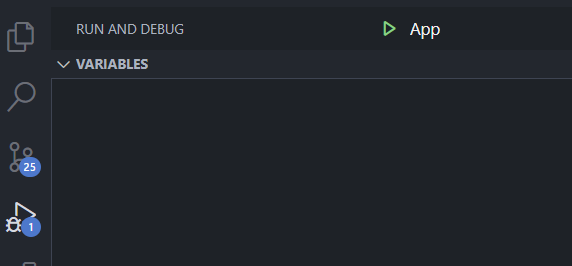

# Cofree Project

## Instalation

#### Requirement

* JDK 19.0.2
* Apache Maven 3.9.2
* org.openjfx - javafx-controls - 13
* org.openjfx - javafx-fxml - 13
* Visual Studio Code and its java extension

#### Step 1

Open visual studio code on the build path, choose Run and Debug tab and choose Start Debugging.

#### Step 2

Phase 1 of the application is user playing the game normally. To play the game simply choose 2 card, each card then will be revealed. User is tasked to match all the card before they completely out of attempt.

#### Step 3

After all attempt is lose, then user will given a popup where the user could click "Reveal Prize" button to view its prize. After click the button, a coupon will be shown to the user depending on the performance in that round. In addition there is a coupon code that will be shown to user that will be saved in "winner.csv" in the project folder.

#### Step 4 (Reset)

After each round, user could restart the game simply by clicked the "Reset" button, then user could play the game again from the step 2
